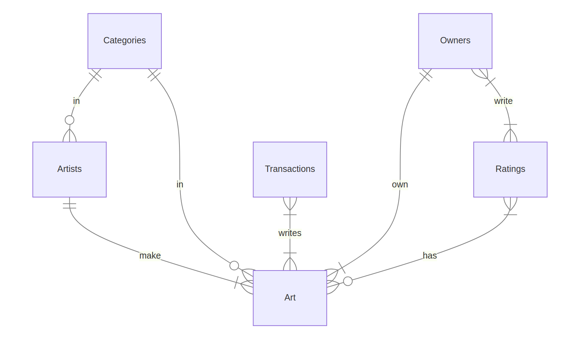

# Design Document

By Gabriel Alfred Krupa

Video overview: [YouTube video](https://www.youtube.com/watch?v=E2aTs52q_Q0)

## Scope

The purpose of this database is to keep track of artists' creation, their value, owners, and satisfactory status thereof. Whilst meticulously noting who and how gained the ownership of any piece of artwork.

Entities in the scope of this database are, as follows:

- `Artists`, containing first and last name, date of birth, and main focus in arts
- `Art`, containing the name of the piece, category, and year of its creation
- `Categories`, including almost every form of art known and their subdomains and genres
- `Owners`, basic information about the ownership
- `Ratings`, include who, when and how rated certain pieces of art
- `Transactions`, contains information about every exchange of the artwork

Out of scope are elements such as an average price of artwork by an artist, owner's financial balance, top 10 artworks by genre, subdomain and domain, top 10 most-sought-after artists, and more.

## Functional Requirements

This database supports:

- CRUD operations for all tables
- Tracking any exchange of artist's work
- Adding multiple rating on each artwork, by which the artist's rating can be determined

For now, database does not support features of financial nature, such as adding, removing or transferring funds.

## Representation

Entities are made in SQLite table and have the following schema.

### Entities

#### Artists

The `artists` table includes:

- `id`, sets unique ID for each artist and has type affinity of `INTEGER`.
  This column, as is the convention, has the `PRIMARY KEY` constraint applied.
- `first_name`, specifies the artist's first name and has type affinity of `TEXT`.
  Type affinity of `TEXT` is commonly used for columns where name is specified.
  `NOT NULL` constraint applied because the artist must have a first name.
- `last_name`, specifies the artist's last name and has type affinity of `TEXT`.
  Reason for using `TEXT` is specified under `first_name`.
  `NOT NULL` constraint applied because the artist must have a last name.
- `dob`, specifies the artist's date of birth in `YYYY-MM-DD` format,
  supports `YYYY-MM-DD HH-MM` format.
  This column has type affinity of `NUMERIC`, such is used for dates and [more](https://www.sqlite.org/datatype3.html#:~:text=Affinity%20Name%20Examples).
  `NOT NULL` constraint applied because the artist was born some point in time.
- `join_date`, sets timestamp of the exact moment when the artist's row is inserted into the table.
  `NUMERIC` type affinity for the same reason as for the `dob` column.
  Timestamp is automatically generated by `DEFAULT CURRENT_TIMESTAMP`.
  `NOT NULL` constraint applied to ensure that the column is not empty.
- `category_id`, specifies the artist's main domain, subdomain and genre of focus.
  `FOREIGN KEY` references the default `rowid` column in `Categories` table to ensure the data integrity.

#### Art

The `art` table includes the following:

- `id`, sets unique ID for artwork.
  Type affinity of `INTEGER` set and `PRIMARY KEY` constraint applied.
- `name`, specifies the name of the artwork and has type affinity of `TEXT`.
  `NOT NULL` set to ensure that the artwork's name is inserted and it has to have a name.
- `year`, specifies what year the artwork was created in `YYYY` format and is of type affinity `INTEGER`.
  `NOT NULL` specified to make avoid empty column.
- `artist_id`, specifies the author of the artwork.
  `FOREIGN KEY` constraint applied, referencing the `id` column from `artist` table to ensure data integrity. `ON DELETE CASCADE` ensure that the row is deleted when the author is removed from the `artist` table.
- `category_id`, specifies the category of the artwork.
  `FOREIGN KEY` constraint applied, referencing the `rowid` column from `categories` table to ensure data integrity. `ON DELETE CASCADE` ensure that the row is deleted when the category is removed from the `categories` table.

#### Categories

The `categories` table includes:

- _`rowid` column is generated by default for each row._
- `domain`, specifies the general form of art.
- `subdoman`, specifies the type of art under its general art form.
- `genre`, specifies the genre of the type.

All columns, _except `rowid`_, have type affinity of `TEXT` and `NOT NULL` constraint.
`UNIQUE` constraint was not applied because there many subdomains, and genres with the same name
under different domains.

#### Owners

The `owners` table contains the following:

- `id`, sets unique ID for each owner as an `INTEGER`. `PRIMARY KEY` constraint applied.
- `first_name`, specifies the owner's first name and has type affinity of `TEXT`.
  Type affinity of `TEXT` is commonly used for columns where name is specified.
  `NOT NULL` constraint applied because the owner must have a first name.
- `last_name`, specifies owner's last name and has type affinity of `TEXT`.
  Reason for using `TEXT` is specified under `first_name`.
  `NOT NULL` constraint applied because owner must have a last name.
- `username`, specifies owner's username and has type affinity of `TEXT`.
  Reason for using `TEXT` is specified under `first_name`.
  `NOT NULL` constraint applied because owner must have a username.
  `UNIQUE` constraint applied because no duplicate usernames are allowed.

At the current state of database, this table introduces redundancies, and increased disk usage.
However, if we upgrade the schema of database and introduce more complexities, such as adding new columns to this table, financial features, keeping track of how long did an owner hold a certain artwork, etc, we would mitigate redundancies, unnecessary disk usage, and could have `VIEW` to avoid unnecessary display of PII [_(Personal Identifiable Information)_](https://fragmadata.com/how-to-store-pii-information-securely/#:~:text=Personally%20identifiable%20information,patients%20as%20well.).

#### Ratings

The `ratings` table includes:

- `id`, sets unique ID for each rating as an `INTEGER`. `PRIMARY KEY` constraint applied.
- `owner_id`, specifies the owner of the artwork as an `INTEGER`.
  `FOREIGN KEY` constraint applied, referencing the `id` column from `owners` table to ensure data integrity.
- `art_id`, specifies the artwork as an `INTEGER`.
  `FOREIGN KEY` constraint applied, referencing the `id` column from `art` table to ensure data integrity.
- `timestamp`, sets timestamp of the exact moment rating was given.
  Type affinity of `NUMERIC` set, as is appropriate from timestamps.
  Timestamp is automatically generated by `DEFAULT CURRENT_TIMESTAMP`.
  `NOT NULL` constraint applied to ensure that the column is not empty.
- `rating`, represents given rating of the artwork. `NOT NULL` constraint applied to ensure that the column is not empty. `DEFAULT 1` constraint sets the rating to 1, if no rating was provided.
  `CHECK("rating" BETWEEN 1 AND 10)` ensures that data is valid by checking if the given rating is in range 1 through 10.

A `description` column could be added to the `ratings` table, in which the owner can provide a lengthy description of the artwork in question.

#### Transactions

The `transactions` table contains:

- `id`, sets unique ID for each transaction as an `INTEGER`. `PRIMARY KEY` constraint applied.
- `owner_id`, specifies the new owner of the artwork as an `INTEGER`.
  `FOREIGN KEY` constraint applied, referencing the `id` column from `owners` table to ensure data integrity.
- `art_id`, specifies the artwork as an `INTEGER`.
  `FOREIGN KEY` constraint applied, referencing the `id` column from `art` table to ensure data integrity.
- `price`, specifies the determined price of artwork in US cents as an `INTEGER`, in order to prevent any miscalculation which typically occur with storage class representing values in decimal format. `NOT NULL` constraint applied to ensure that column is not empty.
- `action`, specifies an action by which the new owner came into possession of the artwork.
  Type affinity `TEXT` set because it is convenient for possible actions.
  `NOT NULL` constraint applied to ensure that column is not empty.
  `CHECK("action" IN ('bought', 'sold', 'gifted', 'created'))` determines if the action specified is allowed.

### Relationships



**Artist** can make one or more pieces of **Art**. **Art** can only have one creator, **Artist**. **Artist** and **Art** can each only be in one **Category**. **Category** can have zero or more both **Artist** and **Art**. **Art** can have one and only one active **Owner**. **Owner** can have one or more **Art**. **Owner** must have at least one **Rating**, vice versa. **Art** can have one or more **Rating**. **Rating** can have zero or more **Art**. **Transaction** must have at least one **Art**, vice versa.

## Optimizations

Seeing as users will most likely want to query the database for either artist, owner, and category information.
There are indexes for `artists`, `owners`, `categories`, and `transactions`.

`artist_idx` decreases the search speed on `id`, `last_name`, and `category` columns.
`owner_idx` covers `id` and `username` columns.
`category_idx` includes `rowid` and `domain` columns.
`transaction_idx` contains `id`, `owner_id`, and `art_id` columns.

Artists have rating based on merit, ie. that is the view called `artist_rating`.
Schema for that view is shown below:

```
CREATE VIEW "artist_rating" AS
SELECT
    "artists"."id" AS "Artist ID",
    "artists"."first_name" AS "First Name",
    "artists"."last_name" AS "Last Name",
    ROUND(SUM("ratings"."rating")/COUNT("ratings"."rating"), 2) AS "Rating"
FROM  "artists"
JOIN "art" ON "artists"."id" = "art"."artist_id"
JOIN "ratings" ON "art"."id" = "ratings"."art_id"
GROUP BY "Artist ID"
ORDER BY "Last Name";
```

<hr/>

Trigger to automate entry into `owners`, `transactions`, and `ratings` table when new `art` is created.
Schema:

```
CREATE TRIGGER new_art_created AFTER INSERT ON art
BEGIN
    -- Set the artist as the owner if it was 'created'
    INSERT OR IGNORE INTO owners(first_name, last_name, username)
    SELECT
        first_name,
        last_name,
        first_name || last_name || id
    FROM artists
    WHERE id = NEW.artist_id;

    INSERT INTO transactions (owner_id, art_id, price, action)
    SELECT id, NEW.id, 0, 'created' FROM owners WHERE username = first_name || last_name || NEW.artist_id
    ORDER BY id LIMIT 1;

    INSERT INTO ratings (owner_id, art_id, rating)
    SELECT id, NEW.id, 1 FROM owners WHERE username = first_name || last_name || NEW.artist_id
    ORDER BY id LIMIT 1;
END;
```

## Limitations

Current state of database is not scalable, nor safe. It lacks security, access control, mitigation of its glaring vulnerabilities, can be optimized to improve performance.
It does not represent the relationship between owners and artists well.
Art can only have one artist, meaning collaboration is not supported.
Art can only be one category, needs many-to-many relationships with `categories` table.
